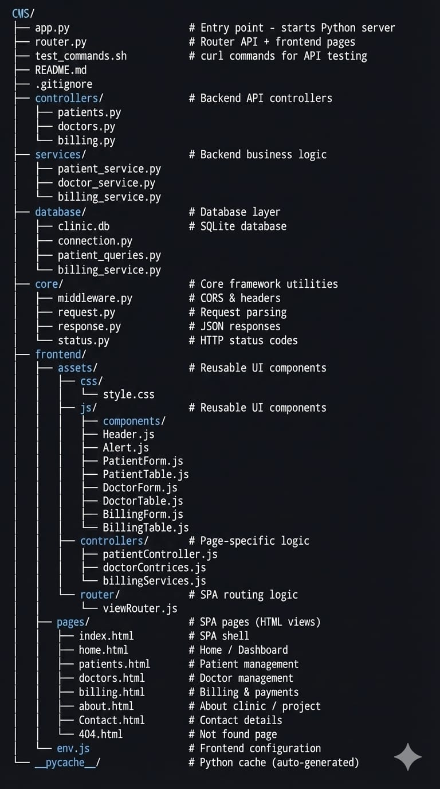

# 🏥**Clinic Management System - README**⚕️

A mini full-stack Clinic Management System built using Python (backend) and Vanilla JavaScript + Tailwind CSS (frontend).

This project simulates how a real clinic operates digitally by managing:
- Patients
- Doctors & schedules
- Billing & payments

It is designed mainly for learning full-stack web development concepts and is ideal for academic / final-year projects.  

## 🚀 What This Project Demonstrates

### 🔹  Full-Stack Development Basics

- REST API design using Python
- Frontend–backend communication using HTTP
- Separation of concerns (controllers, services, database)
- Manual routing without frameworks
- SQLite database integration

### 🎨 Frontend Concepts

- Single Page Application (SPA) architecture
- Dynamic routing without page reload
- Modular JavaScript structure
- Tailwind CSS for responsive UI
- DOM manipulation & event handling
- Component-based UI design:
  - Header
  - Footer
  - Tables
  - Forms
- API consumption using fetch
- UI state handling (edit / view mode)

### 🧠  Backend Concepts
- Python HTTP server using BaseHTTPRequestHandler
- Custom routing system
- API routes vs UI routes
- CRUD operations for:
- Patients
- Doctors
- Bills
- JSON request & response handling
- SQLite database queries
- Error handling & HTTP status codes
- CORS handling for frontend access
  

## 🏗️ Project Structure

## 🔌How the Application Works (Big Picture)
### 1️⃣User Opens the App

- Browser loads index.html
- SPA router dynamically loads pages:
- Home
- Patients
- Doctors
- Billing
